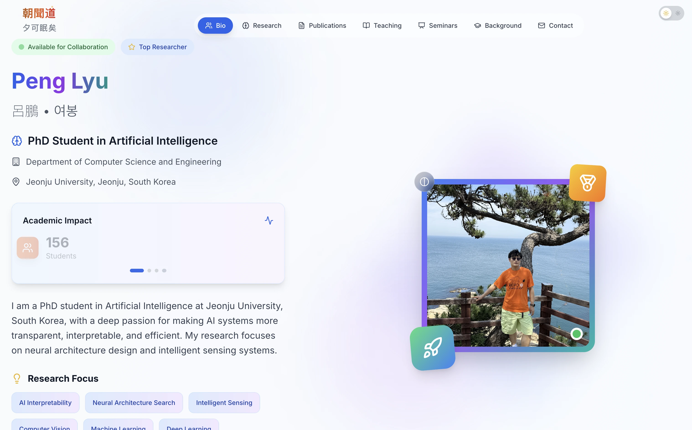

# Peng Lyu's Personal & Academic Portfolio



<p align="center">
  
  
  
  
  
</p>

Welcome to the repository for my personal portfolio. My name is **Peng Lyu (呂鵬, 여봉)**, and I am a PhD candidate in Artificial Intelligence at Jeonju University, South Korea. My research is dedicated to making AI systems more transparent, interpretable, and efficient.

This project is more than a digital CV; it's a practical showcase of my skills in modern web development and a canvas for my creative expression.

---

## ✨ Core Features

* **Modern Design**: A clean, elegant UI with a strong focus on delivering an exceptional user experience.
* **Fluid Animations**: The interface is brought to life with fluid and meaningful animations, powered by Framer Motion.
* **Component-Based Architecture**: Built with a reusable, component-based architecture in React, featuring bespoke elements like the interactive world clock.
* **Continuous Deployment**: Seamlessly deployed on Vercel, with updates pushed live on every commit to your `master` branch.

---

## 🚀 Building a Portfolio Like This: A Step-by-Step Guide

Ever wanted to build a similar portfolio for yourself? It's more straightforward than you might think. Here’s a breakdown of the process and the tools I used.

### 🛠️ Step 0: The Toolkit (Prerequisites)

Before you begin, ensure you have the following installed on your machine:

* **Node.js**: [Download the LTS version here](https://nodejs.org/)
* **Git**: [Download here](https://git-scm.com/)
* **A Code Editor**: I highly recommend [Visual Studio Code](https://code.visualstudio.com/)

### 🏠 Step 1: Initialise the Project with Next.js

Next.js is a powerful React framework that makes bootstrapping and deploying projects remarkably simple. Open your terminal and run the following command:

```bash
npx create-next-app@latest my-portfolio
```

During the setup, you will be prompted with several options. I recommend the following configuration:

* `Would you like to use TypeScript?` **Yes** (Essential for robust, type-safe code.)
* `Would you like to use ESLint?` **Yes** (Keeps the codebase clean and consistent.)
* `Would you like to use Tailwind CSS?` **Yes** (The core tool for our styling.)
* `Would you like to use 'src/' directory?` **Yes** (For better project organisation.)
* `Would you like to use App Router?` **Yes** (The latest and recommended routing system.)

### 🎨 Step 2: Sculpting the UI with Tailwind CSS

Tailwind CSS is a utility-first CSS framework that allows you to build sophisticated designs directly within your markup.

* **Gathering Inspiration**: Before writing any code, it’s wise to sketch out your ideas, perhaps using tools like [Figma](https://www.figma.com/). Websites like [Awwwards](https://www.awwwards.com/) and [Dribbble](https://dribbble.com/) are excellent sources of inspiration.
* **Component Construction**: Break down your design into logical components (e.g., Header, Profile Section, Footer). Then, assemble them using `div`s and Tailwind's utility classes (`bg-gray-900`, `text-white`, `flex`, etc.).

### 🎬 Step 3: Adding Animation with Framer Motion

Static sites can feel a bit lifeless. Framer Motion is a wonderfully simple yet production-ready animation library for React.

1. **Installation**:
    ```bash
    npm install framer-motion
    ```
2. **Implementation**:
    Simply replace a standard `<div>` with `<motion.div>` and declare animations using props like `initial`, `animate`, and `whileHover`. For instance, to make an element fade and scale into view:
    ```jsx
    import { motion } from 'framer-motion';
    
    <motion.div
      initial={{ opacity: 0, scale: 0.8 }}
      animate={{ opacity: 1, scale: 1 }}
      transition={{ duration: 0.8 }}
    >
      Hello, World!
    </motion.div>
    ```

### 🧩 Step 4: Creating Your Signature Components

The soul of a personal portfolio lies in its unique, custom-built components.

* **The World Clock**: As demonstrated in this project, combining React hooks (`useState`, `useEffect`) with clever CSS like `group-hover` can produce elegant, interactive elements.
* **Academic Cards**: Use Flexbox or CSS Grid to beautifully organise your publications, research interests, and other academic achievements.

### ☁️ Step 5: One-Click Deployment with Vercel

Vercel is the creator of Next.js, making it the natural choice for seamless, zero-configuration deployments. It’s also free for personal projects.

1. **Push to GitHub**: Ensure your project is a GitHub repository and that you have pushed all your latest changes.
2. **Import to Vercel**: Visit the [Vercel website](https://vercel.com/), sign in with your GitHub account, and select 'Add New... -\> Project'.
3. **Select Your Repository**: Choose the GitHub repository you just pushed and click 'Import'.
4. **Deploy**: Vercel automatically detects that it's a Next.js project. No configuration is needed. Simply click 'Deploy'. Within minutes, your website will be live on a global CDN. Better still, Vercel enables Continuous Deployment: every time you push a change to your `main` branch, your live site is updated automatically.

---

## 💻 Running This Project Locally

To clone this repository and run it on your own machine for learning or modification purposes, follow these steps:

```bash
# 1. Clone the repository
git clone [https://github.com/your-username/your-repo-name.git](https://github.com/your-username/your-repo-name.git)

# 2. Navigate into the project directory
cd your-repo-name

# 3. Install all dependencies
npm install

# 4. Start the development server
npm run dev
```

Now, open `http://localhost:3000` in your browser to see the project running.

---

## 🤝 Get in Touch

Thank you for taking the time to explore my project. If you have any questions about my research or would like to connect, please don't hesitate to reach out.

* **GitHub**: [@PengLyu-Star](https://github.com/LyuPeng-star)
* **LinkedIn**: [Peng Lyu](https://www.linkedin.com/in/lyupaif/)
* **Email**: [lyupaif@jj.ac.kr](mailto:lyupaif@jj.ac.kr)
